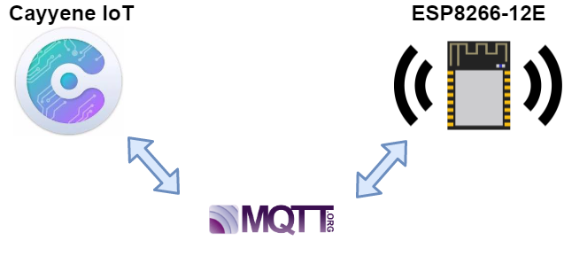
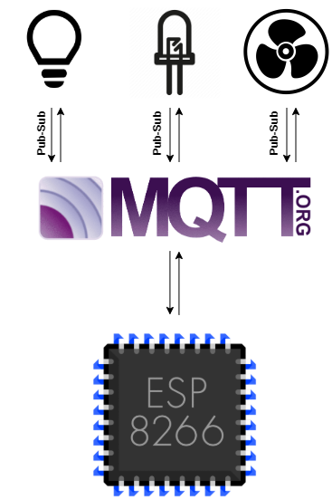

# CAYENNE IOT WITH ESP8266
## Overview

  

  

 

  
  
The system consists of three gadgets like a **LED**,**BULB**,and **FAN** in the `Cayenne` dashboard.Which sends its digital values to ESP8266 via **MQTT**.

## Software
* [Arduino IDE](https://www.arduino.cc/en/Main/Software) for Windows, Linux or Mac OS.

## Steps :
 1. **Download** the repo.
 
 2. For those who don't have a cayenne dashboard 😇 download the ***CAYENNE IOT WITH ESP8266*** named pdf from the **DOC** folder and carefully read it. 
    Create a dashboard with at least one gadget and make simulation possible with **ESP8266**.Create your Cayenne account at https://www.cayenne-mydevices.com.
   
 3. Open **LIB** folder then place the `CayenneMQTT`(version 1.3.0) folders into your arduino local dierectory folder (libraries) from the downloaded repo.Place this library         from my repo or you can download the library from the arduino library manager.
 
 4. The source code for our ESP8266 simulation can be found in the **CODE** folder. Open **source code** from the downloaded repo and make some changes as mentioned below :
   
   - Open **global.h** and provide your wifi router's `ssid` and `password` :
    

  

  
  
   - Open **cmqtt.cpp** and fill your credentials here 👇 .For more info refer the document ***page number 3***     
      

  

 
  
## MQTT Status (Must read !!!!👈) 

If you download the library from `arduino library manager`you should comment one of the function in the given source code to avoid ***compilation error***.

  
  
Open **cmqtt.cpp** and comment:

    

  

 
  

  
Better use my library 👍 from the **LIB** folder because I have included some changes in the `Cayenne library` for knowing the  Cayenne MQTT `connection status` and its serial print acknowledgment in Arduino IDE like the below image. It will really help us to know whether the ESP8266 connected or not to the **Cayenne dashboard** and also it will rectify he above mentioned issue😃. 

 

  

   
  
* If you go for direct library download you ***gonna miss*** this acknowledgment. But there is no issue with working on the source code. 

## Compatibility
This library was tested with the NodeMCU V1.0 ESP8266  development board. It should also work with other standard ESP8266 that are compatible with the Arduino IDE.
ESP8266 core version that I have tested is `2.4.2` 

## Working 
Demonstration of `publish` and `subscribe` between **ESP8266** and **Cayenne** dashboard described in the documentation from ***page No:7*** onwards and good luck!!!✌️.

  
</p
